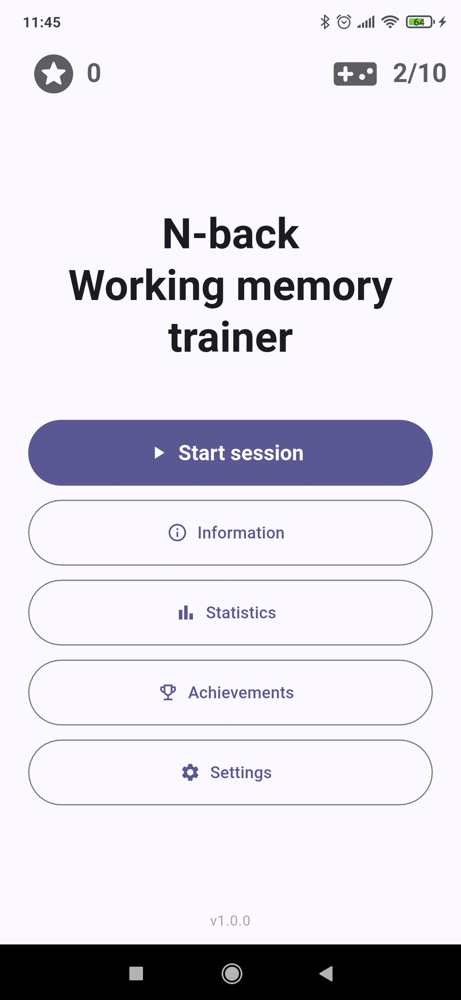
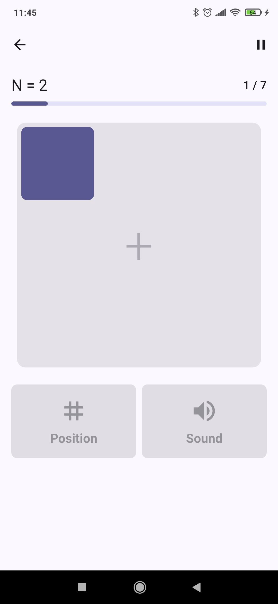
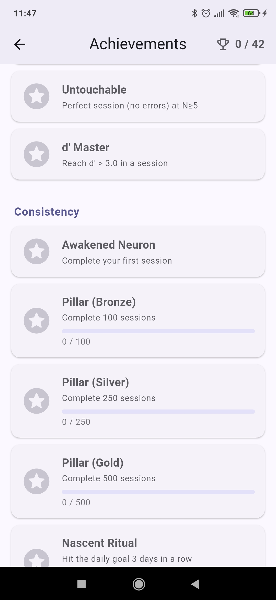
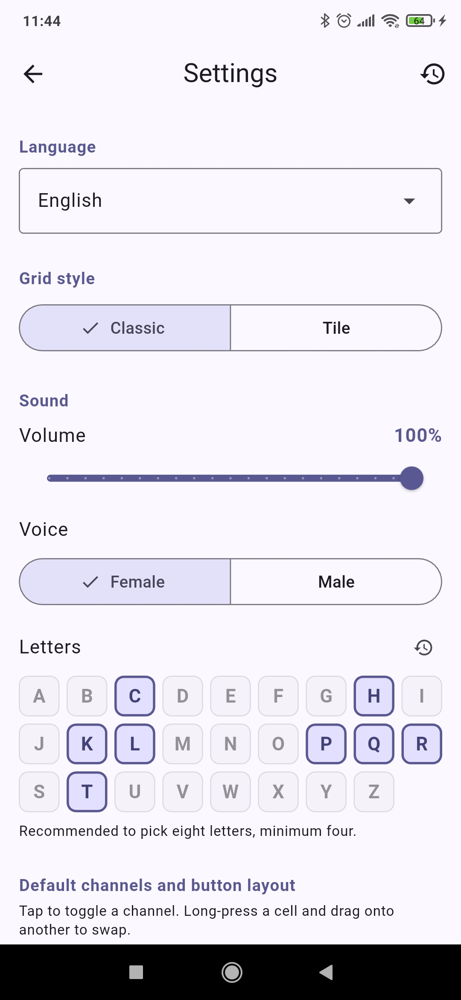
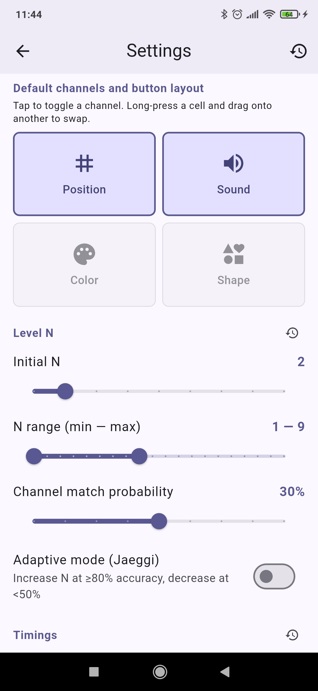
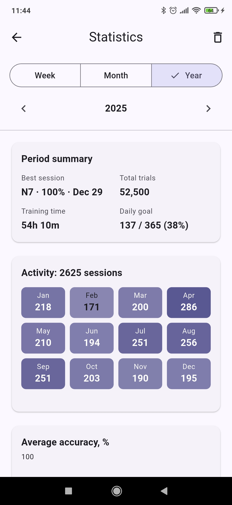

# Dual N-Back

A Flutter mobile app for training working memory with the N-back task — single, dual, or quad channels (position, audio, color, shape). Implements the Jaeggi adaptive protocol, persists per-session history, and tracks daily goals, streaks and achievements. No accounts, no networking — everything runs locally.

<p align="center">
  
  
  
</p>
<p align="center">
  
  
  
</p>

## Features

- Single / Dual / Quad N-back with independent channels: position, audio (spoken letters), color, shape.
- Configurable 2x2 button layout (drag-to-swap).
- Jaeggi adaptive N support: auto-increase at ≥80% per-channel accuracy, auto-decrease at <50%.
- Customizable timings (stimulus duration, fade, ISI), match probability, N range.
- Audio channel with female/male voice and a configurable letter set
- Optional response feedback per channel: green flash and sound on a hit, red flash and sound on a false alarm, yellow flash and sound when a real match is missed
- Per-session history with charts (accuracy, max N, d′, per-channel accuracy, activity heatmap, N distribution).
- Daily session goal with streak counter and rest-day support.
- 42 monotonic achievements across 5 groups (Milestones, Performance, Consistency, Resilience, Exploration).
- Local "time to train" notifications.
- Localized (English / Russian, auto-detected from system locale).
- Light / dark theme follows the system.

## Tech stack

- Dart 3.11+ / Flutter 3.41 stable
- `flutter_riverpod` 3.x for state management
- `go_router` for navigation
- `shared_preferences` for settings, `drift` (+ `sqlite3_flutter_libs`) for session history
- `audioplayers` in low-latency mode (SoundPool on Android) for letter audio
- `fl_chart` for charts
- `flutter_local_notifications` for daily reminders
- `very_good_analysis` lints

## Build & run

Requires Flutter 3.41 stable or newer.

```sh
flutter pub get
flutter run -d <device-id>            # debug
flutter run -d <device-id> --release  # release
flutter build apk --release           # standalone APK
```

After changing drift tables (`lib/features/statistics/data/database.dart`):

```sh
dart run build_runner build --delete-conflicting-outputs
```

After changing ARB files in `lib/l10n/`:

```sh
flutter gen-l10n   # also runs automatically on `flutter pub get`
```

After changing the icon source:

```sh
dart run tool/generate_icon.dart       # regenerate assets/icon/icon.png
dart run flutter_launcher_icons        # propagate to Android mipmaps
```

## Tests

```sh
flutter analyze
flutter test
```

Tests use Riverpod overrides + in-memory backends (mock `SharedPreferences`, in-memory drift database, `SilentAudioService`). Timer-based logic uses `fake_async`.

## Project layout

Feature-first + light clean architecture. Each feature has `domain` (pure Dart), `application` (Riverpod), and `presentation` (widgets).

```
lib/
├── main.dart, app.dart
├── core/         — audio, constants, theme, router
├── features/
│   ├── achievements/
│   ├── game/
│   ├── info/
│   ├── settings/
│   └── statistics/
├── shared/widgets/
└── l10n/         — ARB sources + generated AppLocalizations
```

## Platforms

- **Android** — primary, tested on a physical device.
- **iOS** — deferred (no current macOS access); the codebase has no Android-only platform calls outside the audio backend.

## License

[WTFPL](LICENSE) — do what you want.
